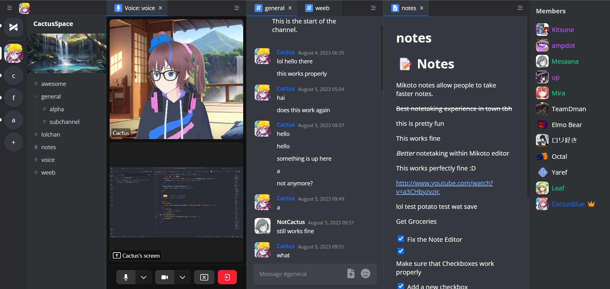

<p align="center">
  
</p>

<h1 align="center">
  Mikoto
</h1>

<p align="center">The Most Overkill Messaging App in the World.</p>
<p align="center">
  <a href='https://mikoto.io'>Website</a> · 
  <a href='https://alpha.mikoto.io'>Alpha</a> ·
  <a href='https://docs.mikoto.io'>Docs</a> ·
  <a href='https://blog.mikoto.io'>Blog</a> ·
  <a href='https://twitter.com/mikotoIO'>Twitter</a>
</p>
<br>

Mikoto is an messaging platform designed for building online communities. It uses a thread-based structure for text messaging, voice/video chat, and real-time collaborative wiki editing.

<p align="center">
  
</p>

## Features

> Note: Mikoto is still in early development. Some of these features are not fully implemented.

- ✨ Open Source (with proprietary extensions for enterprise support)
- ⚡️ Superuser friendly features, like tab view, zen mode and, keyboard shortcuts and more
- 📡 Voice, video, and screen sharing
- 📝 Real-time collaborative wiki channels
- 🧵 Next-generation thread management
- 🏡 Threaded DMs and group DMs
- 🎨 Customizable themes and appearances

and upcoming features:

- 🪐 [DID-based](https://www.w3.org/TR/did-core/) usernames
- 🔒 E2E encrypted DMs and Group DMs
- 🔍 Semantic search across all channels
- 🔌 Pluggable architecture for custom extensions
- 🛒 A marketplace for extensions and integrations
- 🌎 Built-in community finder
- 🥸 A system to handle multiple personas and identities

## Setup

Prerequisites:

- Docker
- Rust 1.81+
- Node.js 22+
- sqlx CLI (`cargo install sqlx-cli --no-default-features --features rustls,postgres`)


```sh
# use corepack
corepack enable

# install dependencies
pnpm install
cargo check

# Copy .env.example to .env and set the variables
cp ./apps/superego/.env.example ./apps/superego/.env

# migrate database (run in superego directory)
sqlx database create && sqlx migrate run

# start services (PostgreSQL, Redis, MinIO, etc.)
docker-compose up
```

### Development

Mikoto uses a turborepo-based monorepo.

Use Docker Compose to run the necessary services.

To develop apps and packages, run the following command:

```sh
pnpm start
```

To browse/edit the Database run the following command:

Check Dockerfiles and Github Actions for more details, until more documentation is added.

```sh
cd apps/server
prisma studio
```

### Build

To build all apps and packages, run the following command:

```sh
yarn build
```

## Port Configuration

All Mikoto services use ports in the `351X` or `351XX` range to avoid conflicts with other common services:

### Application Services (351X)

| Service        | Port | Description                      |
| -------------- | ---- | -------------------------------- |
| Superego       | 3510 | API server                       |
| Collab         | 3512 | Collaboration service            |
| MediaServer    | 3513 | Media handling service           |
| Client         | 3519 | Web client (served via nginx)    |

### Infrastructure Services (351XX)

| Service        | Ports                | Description                      |
| -------------- | -------------------- | -------------------------------- |
| PostgreSQL     | 35101                | Database                         |
| Redis          | 35102                | Cache & pub/sub                  |
| MinIO (S3)     | 35103, 35104         | Object storage                   |
| LiveKit        | 35105, 35106, 35107  | Real-time audio/video            |
| MailHog        | 35108, 35109         | Development mail server          |
| Meilisearch    | 35110                | Search engine                    |

## License

While we're still an early-stage project and the licensing may change in the future, Mikoto is currently dual licensed under AGPL core and a proprietary license. Please email cactus (at) mikoto.io if you are interested in enterprise uses for Mikoto.
