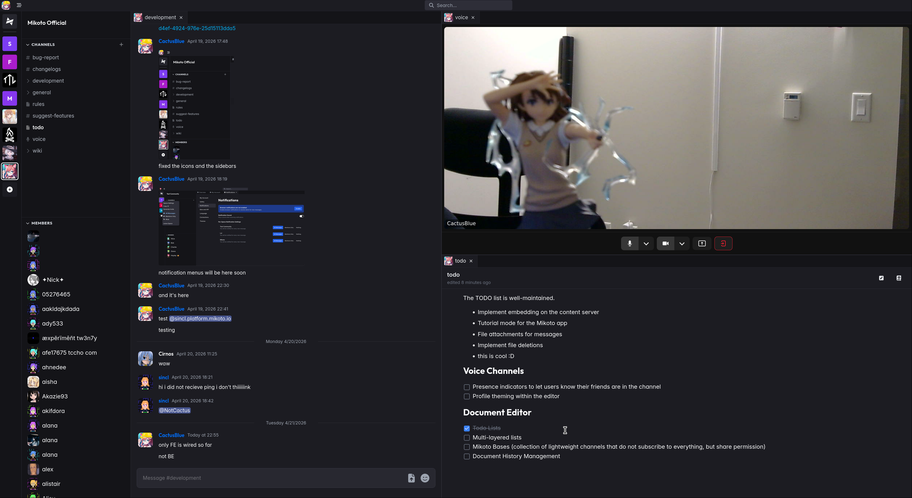

<p align="center">
  
</p>

<h1 align="center">
  <a href='https://mikoto.io'>mikoto.io</a> 
</h1>

<p align="center">The Most Overkill Messaging App in the World.</p>
<br>

<p align="center">
  
</p>

## features

- 📑 tabs
- 🀄 tiling window manager
- 🧵 threaded messages
- 📡 voice, video, and screen share
- 📝 real-time wiki channels using Y.js
- zen mode
- 🅱️ keyboard shortcuts
- 📨 direct messages

and upcoming:

- 🌎 built-in community finder
- 🔍 search channels
- 🪐 [DID-based](https://www.w3.org/TR/did-core/) usernames
  - 🥸 subdomains for multiple personas and identities
- 🔒 encryption
- 🎨 custom themes
- 🛒 marketplace for extensions and integrations

## Setup

Prerequisites:

- Docker
- [Rustup](https://rustup.rs/)
- [Proto](https://moonrepo.dev/proto) (tool manager, used to install moonrepo)
- Just (task runner)

```sh
proto install
pnpm install

# Copy .env.example to .env and set the variables
cp ./.env.example ./.env

# Reset and seed the environment
just reset-dev-env
```

### Development

Mikoto uses a Moon-based monorepo.

To develop apps and packages, run the following command:

```sh
docker compose up -d # Run auxiliary services
just start-dev # runs the base scripts
```

### Build

To build all apps and packages, run the following command:

```sh
moon :build
```

## Port Configuration

All Mikoto services use ports in the `351X` or `351XX` range to avoid conflicts with other common services:

### Application Services (351X)

| Service     | Port | Description            |
| ----------- | ---- | ---------------------- |
| Client      | 3510 | Web client             |
| Superego    | 3511 | API server             |
| Collab      | 3512 | Collaboration service  |
| MediaServer | 3513 | Media handling service |

### Infrastructure Services (351XX)

| Service     | Ports               | Description             |
| ----------- | ------------------- | ----------------------- |
| PostgreSQL  | 35101               | Database                |
| Redis       | 35102               | Cache & pub/sub         |
| RustFS (S3) | 35103, 35104        | Object storage          |
| LiveKit     | 35105, 35106, 35107 | Real-time audio/video   |
| MailHog     | 35108, 35109        | Development mail server |
| Meilisearch | 35110               | Search engine           |

## Docs

[docs.mikoto.io](https://docs.mikoto.io)

## License

Dual licensed under AGPL core and a proprietary license.

See [LICENSE](./LICENSE)

